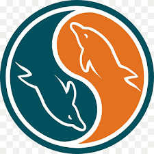

### Hi there 👋

### About me

- Hi there 👋 I’m a full stack developer and a passionate learner.
- 🔭 I’m currently working as a full stack web developer in a project based role . 
- 🌱 I’m currently learning NOSQL databases.
- 💬 Ask me about HTML, CSS, JavaScript, Bootstrap, React, Python, Django, FLask, MYSQL, postgreSQL,linux, AWS and anything web related
- 📫 How to reach me: you can email me at amr.3brazek@gmail.com 

## My Skills

### Front-End:

### Back-End:

### General:

<!--
**Amrabrazek/Amrabrazek** is a ✨ _special_ ✨ repository because its `README.md` (this file) appears on your GitHub profile.

Here are some ideas to get you started:

- 🔭 I’m currently working on ...
- 🌱 I’m currently learning ...
- 👯 I’m looking to collaborate on ...
- 🤔 I’m looking for help with ...
- 💬 Ask me about ...
- 📫 How to reach me: ...
- 😄 Pronouns: ...
- ⚡ Fun fact: ...
-->
